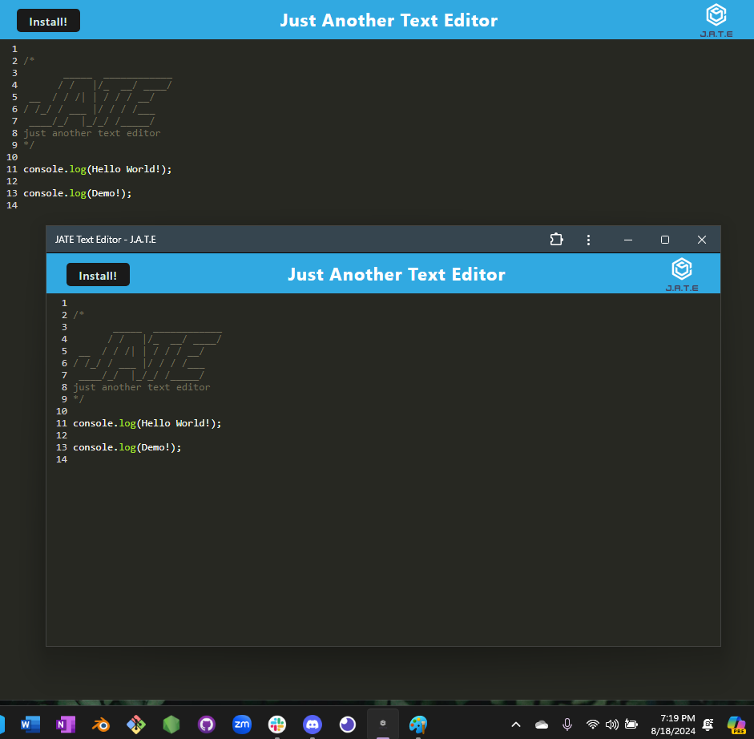
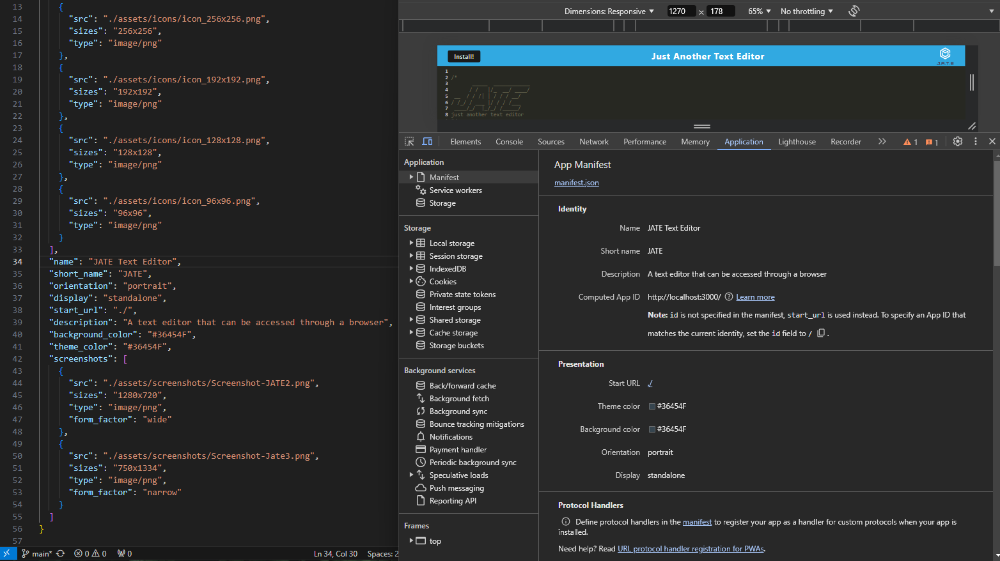

# PWA-EditorEase

PWA EditorEase is a text editor for creating notes or code snippets, whether you're online or offline! This Progressive Web Application combines modern web technologies to ensure that your content is always at your fingertips, even without an internet connection.

PWA-EditorEase lets you focus on your content without worrying about connectivity. With support for next-gen JavaScript and a reliable storage system using IndexedDB, you can trust that your notes are always ready for retrieval.

- Enjoy the flexibility of working online or offline. Your content is automatically saved and retrieved with IndexedDB.

- Bundle your JavaScript files effortlessly with Webpack. Everything you need, packaged and ready to go.

- Take advantage of modern web technologies. Service workers, manifest files, and offline capabilities are built right in.

- Install the app as an icon on your desktop and your text editor is just a click away!

## Installation

To install PWA EditorEase:

- Clone the repository: https://github.com/girlnotfound/PWA-EditorEase

- Navigate to the project directory

- Open the terminal and install the dependencies by running the command: `npm install`

## Usage

- Start the application, in the terminal run the command: `npm run start`

- Open the text editor from your terminal. Your JavaScript files will be bundled using Webpack, ensuring smooth operation.

- You will be redirected to the application: `http://localhost:3000/`

- When in the browser: click 'Install' to get an offline desktop version of the application.

[Link to Deployed PWA-EditorEase](https://pwa-editorease.onrender.com/)

## Credits

This project was made possible with the help of:

[Adam Rosenberg](https://github.com/AcoderRose)

[Ryan Petersen](https://github.com/RyanPetersen-89)
